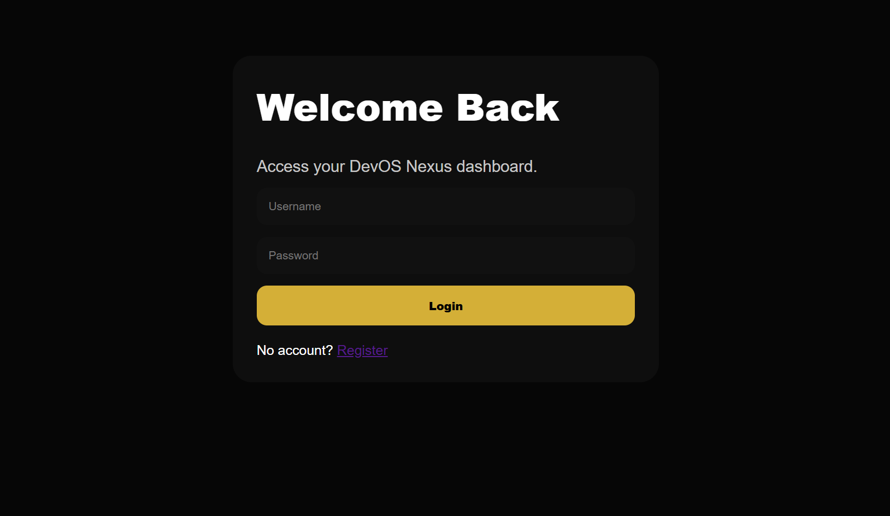
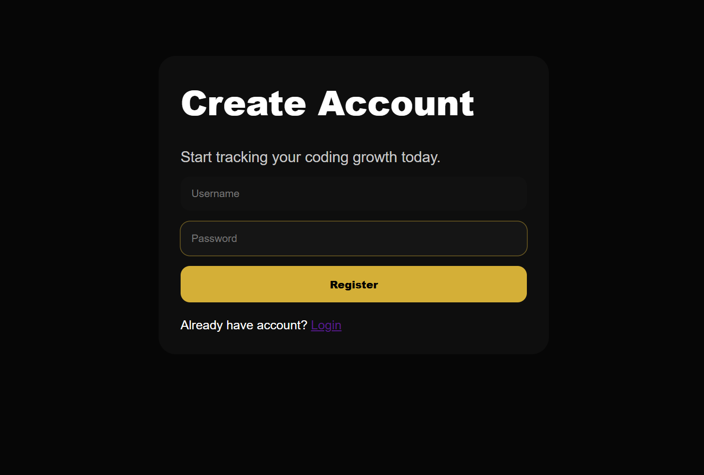
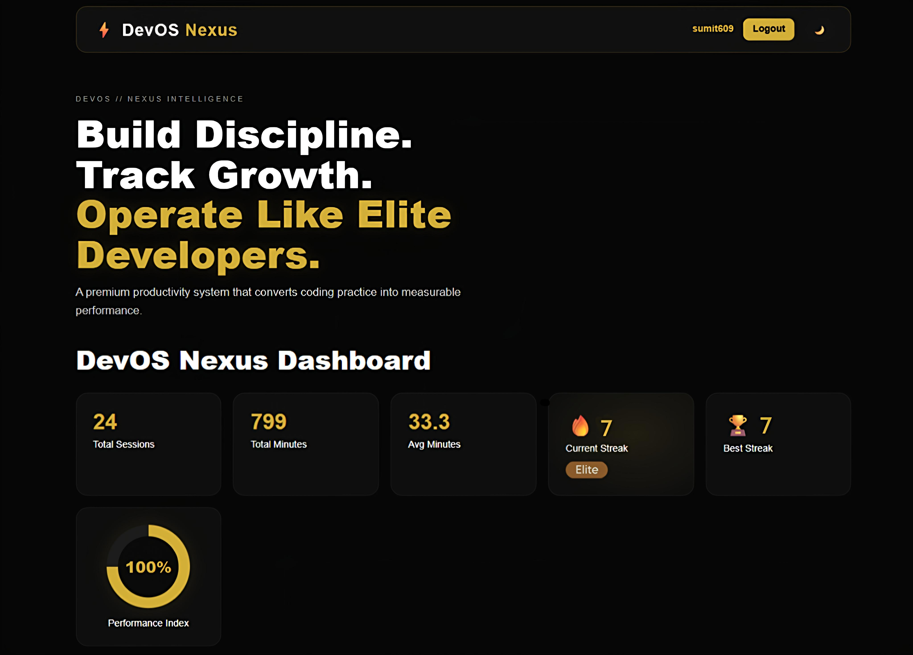
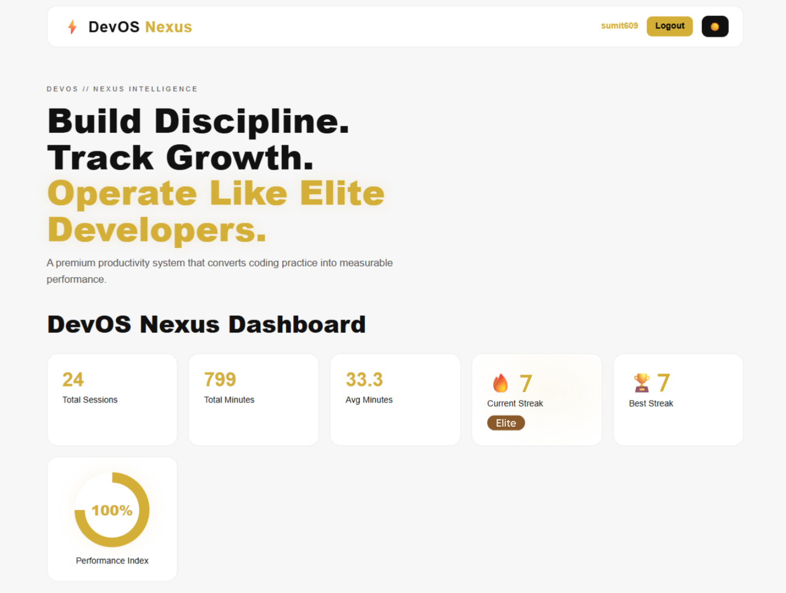
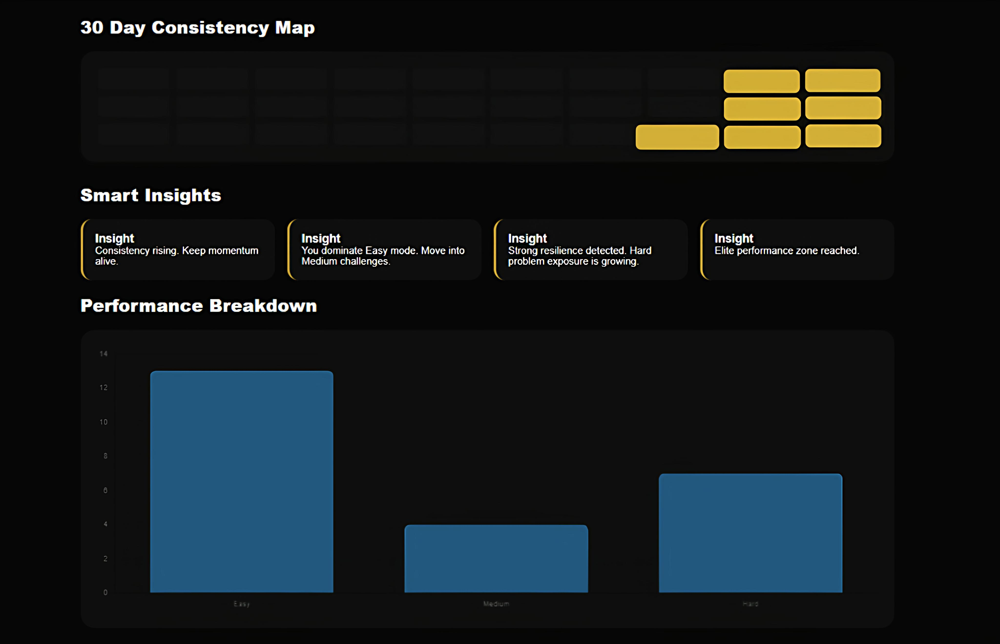
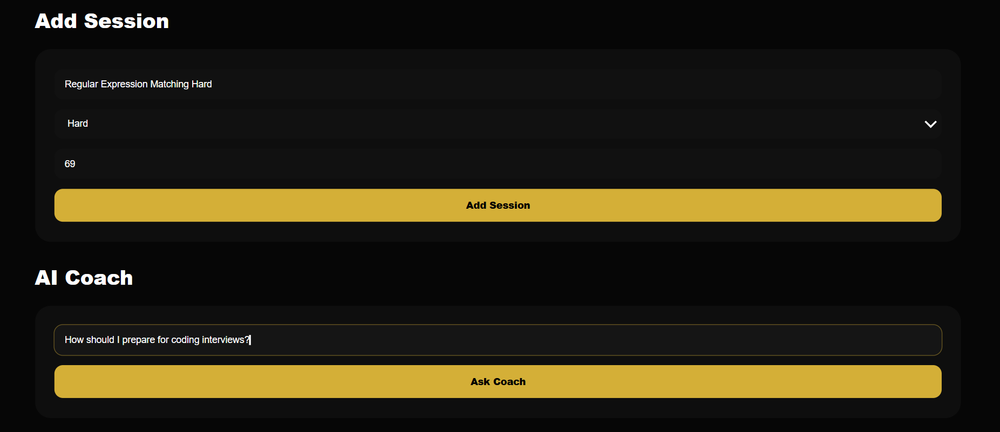
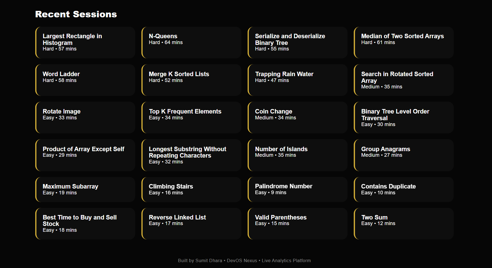

# ⚡ DevOS Nexus — Developer Operating System

> Transforming coding practice into a measurable growth engine.

🌐 **Live Demo:** [Open DevOS Nexus](https://sumitbyte-devos-nexus.onrender.com)

DevOS Nexus is a premium full-stack productivity platform built to help developers **track coding sessions, analyze performance, measure consistency, and improve intelligently through data**.

What started as a CLI tool evolved into a live web platform after **6 months of continuous building, redesigning, debugging, and upgrading.**

> 🚀 Built independently while still in high school with a focus on discipline, systems thinking, and meaningful developer productivity.

---

# 🌍 The Idea

Most students solve problems randomly.

They rarely know:

- How consistent they truly are  
- Which difficulty level slows them down  
- How much time they lose  
- Whether they are actually improving  
- If their effort is strategic or just repetitive  

## DevOS Nexus solves this.

It transforms coding practice into a system of:

### Precision • Consistency • Growth

---

# 🛤️ 6-Month Evolution Journey

## Month 1 — First Principle Thinking

The journey began with a simple question:

**Why do students track marks, but not effort?**

This month focused on defining the real problem:

- Developers practice without data  
- Progress feels random  
- Consistency is hard to measure  
- No personal feedback loop exists  

Initial CLI concept was born.

---

## Month 2 — CLI Foundation Build

The first version of DevOS was built as a command-line productivity engine.

Core systems added:

- Session logging  
- Problem difficulty tracking  
- Time tracking  
- Local data storage  
- Clean terminal experience  

This phase proved the concept worked.

---

## Month 3 — Analytics Engine

DevOS moved beyond tracking into intelligence.

New additions:

- Weekly reports  
- Average solve time  
- Productivity summaries  
- Difficulty distribution  
- Growth insights  
- Performance trends  

The project became more than a tracker.

It became an analytics system.

---

## Month 4 — Product Identity & Experience

Focus shifted from code to product quality.

Major upgrades:

- Better branding  
- Naming evolution into **DevOS Nexus**  
- Premium positioning  
- UI planning  
- Web dashboard architecture  
- Better user journey thinking  

This month shaped the product vision.

---

## Month 5 — Web Platform Development

CLI evolved into a live Flask web application.

Major systems built:

- User registration  
- Secure login flow  
- Personal dashboards  
- Session database  
- Charts & analytics  
- AI Coach  
- Responsive premium interface  

This was the transformation stage.

---

## Month 6 — Launch Month

The final month focused on shipping publicly.

Major milestones:

- Debugging deployment issues  
- Database fixes  
- Render hosting setup  
- README redesign  
- Screenshots & branding assets  
- GitHub publishing  
- Public live demo release  

## 🚀 GitHub Launch Completed In Month 6

After six months of persistence, DevOS Nexus officially went live.

> DevOS was not built quickly.  
> It was built patiently.

---

# 🔥 Current Versions

## 🖥️ DevOS CLI

Terminal-based coding productivity engine.

## 🌐 DevOS Nexus Web

Live full-stack analytics dashboard with premium UI.

---

# ✨ Core Features

## 📊 Performance Intelligence

- Total coding sessions tracked  
- Total time invested  
- Average solving time  
- Performance Index score  
- Difficulty breakdown chart  

## 🔥 Consistency System

- Current streak  
- Best streak  
- Rising / Hot / Elite badges  
- 30-day heatmap tracker  

## 📝 Smart Session Tracking

Track every coding session with:

- Problem title  
- Difficulty level  
- Minutes taken  
- Timestamp history  

## 🔐 User System

- Register / Login  
- Private dashboards  
- Individual progress tracking  

## 🤖 AI Coach

Interactive in-product coaching assistant for:

- Speed improvement  
- Hard problem mindset  
- Motivation  
- Interview direction  

---

# 📸 Product Preview

## 🔐 Login Experience


---

## 📝 Register Experience


---

## 🌙☀️ Main Hero Dashboard (Dark + Light Mode)

<table>
<tr>
<td width="50%">
<b>Dark Mode</b><br>

</td>

<td width="50%">
<b>Light Mode</b><br>

</td>
</tr>
</table>

---

## 📊 Heatmap + Smart Insights + Performance Breakdown


---

## 🤖 Add Session + AI Coach


---

## 📜 Recent Sessions


---

# 🧠 Why DevOS Nexus Is Different

Most trackers only store activity.

## DevOS interprets activity.

It helps answer:

- Am I progressing?
- Where am I weak?
- How efficient am I?
- Is my consistency real?
- What should I improve next?

---

# 🛠️ Tech Stack

## Backend
- Python
- Flask
- Flask-Login
- Flask-SQLAlchemy

## Frontend
- HTML
- CSS
- Jinja2 Templates

## Analytics
- Matplotlib

## Database
- SQLite

## Deployment
- Render (Live Hosting)

---

# 🚀 Getting Started

## Clone Repository

```bash
git clone https://github.com/sumitdhara609/devos-nexus.git
cd devos-nexus
```
## Install Dependencies

```bash
cd devos-web
pip install -r requirements.txt
```
## Run Web Version

```bash
cd devos-web
python app.py
```
## Open Browser:

```bash
http://127.0.0.1:5000
```
## Run CLI Version

```bash
python main.py
```
---

## 📂 Project Structure
```bash
devos-nexus/
│── README.md
│── main.py
│── ai.py
│── analysis.py
│── storage.py
│── weekly.py
│── export.py
│
└── devos-web/
    │── app.py
    │── requirements.txt
    │── Procfile
    │── assets/
    │── templates/
    │── static/
```
---

## 📸 Core Dashboard Includes
- Performance cards
- Productivity scoring
- Daily streak system
- 30-day heatmap
- AI Coach
- Analytics chart
- Session feed
- Dark / Light mode

---

## 🧠 Why I Built This
I wanted more than solving problems.

I wanted a system that builds:

- Discipline
- Awareness
- Measurable growth
- Long-term consistency

So I built one.

---

## 🚀 Future Roadmap
- PostgreSQL production database
- AI powered real coach (OpenAI/Copilot)
- LeetCode / Codeforces API sync
- Advanced smart streak system
- Leaderboards
- Public user profiles
- React frontend version
- Mobile app version

---

## 👤 Author

**Sumit Dhara**  
Student Developer focused on building systems that improve growth, learning, and productivity.

---

## 📜 License
 This project is open-source under the  **MIT License.**

#### © 2026 Sumit Dhara. All rights reserved.

---

## ⭐ Support 
- DevOS Nexus took 6 months of persistence to launch publicly.
- If you appreciate builders who keep improving until ideas become real products, consider giving this repository a **star.**